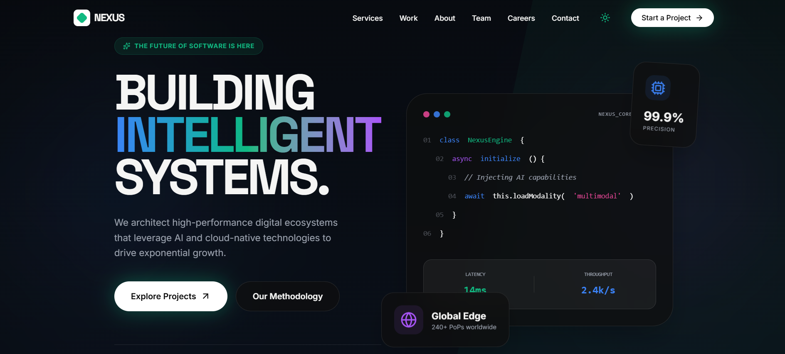

# NextUp 🚀

NextUp is a modern, responsive web application built with **Vite + TypeScript**. It’s designed to be fast, scalable, and developer-friendly, leveraging the latest frontend technologies for a smooth user experience.



[Live Demo](https://next-up-ten.vercel.app/)

---

## Features ✨

* Fast and responsive interface
* Built with **Vite + TypeScript** for modern development
* Clean and modular folder structure
* Ready for deployment on **Vercel**
* Easy to extend with new components or features

---

## Tech Stack 🛠

* **Frontend:** TypeScript, React (assumed from Vite project)
* **Build Tool:** Vite
* **Hosting:** Vercel
* **Version Control:** Git & GitHub

---

## Installation & Setup ⚡

1. Clone the repository:

```bash
git clone https://github.com/Shanjid188/NextUp.git
```

2. Navigate to the project folder:

```bash
cd NextUp
```

3. Install dependencies:

```bash
npm install
```

*or using Yarn*

```bash
yarn
```

4. Start the development server:

```bash
npm run dev
```

This will launch the app on `http://localhost:5173` (default Vite port).

---

## Build & Deployment 📦

To create a production build:

```bash
npm run build
```

Deploy the build folder (`dist`) to **Vercel** or any static hosting platform.

---

## Folder Structure 📂

```
NextUp/
├─ public/          # Static assets
├─ src/             # Source code
│  ├─ components/   # Reusable components
│  ├─ pages/        # Page components
│  └─ main.tsx      # App entry point
├─ package.json     # Project dependencies & scripts
├─ tsconfig.json    # TypeScript config
└─ vite.config.ts   # Vite configuration
```

---

## Contributing 🤝

Contributions are welcome! Please follow these steps:

1. Fork the repo
2. Create a new branch (`git checkout -b feature-name`)
3. Make your changes and commit (`git commit -m "Add feature"`)
4. Push to the branch (`git push origin feature-name`)
5. Open a Pull Request

---

## License 📄

This project is **MIT Licensed** — feel free to use and modify it.

---

If you want, I can also **add a polished “project screenshot and badges” section** to make it look like a professional portfolio-ready README, just like production apps on GitHub.

Do you want me to do that next?
